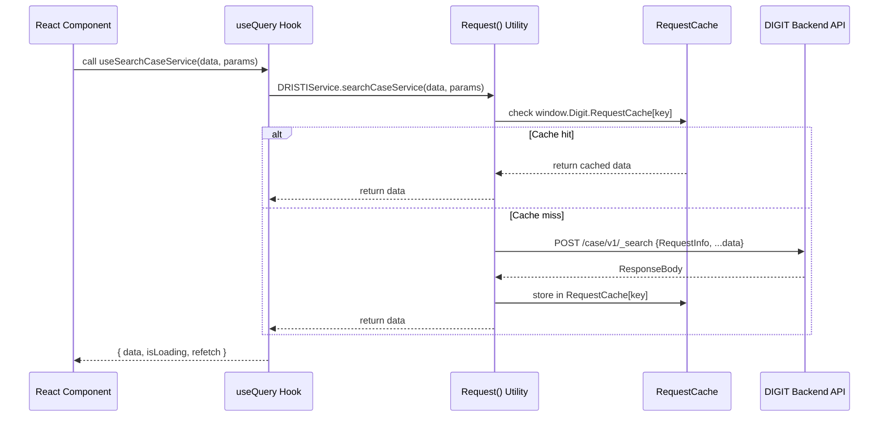

# Architecture

## System Overview

DRISTI Frontend is a **micro-frontend monorepo** — multiple independently deployable applications sharing a common runtime and design system. It follows a **Backend For Frontend (BFF)** pattern for document generation.

```
                        Browser
                           │
           ┌───────────────┼───────────────┐
           │               │               │
    ┌──────▼──────┐ ┌──────▼──────┐ ┌─────▼──────┐
    │  oncourts-  │ │  oncourts-  │ │ workbench- │
    │landing-page │ │     ui      │ │    ui      │
    │  (Next.js)  │ │ (React SPA) │ │(React SPA) │
    └──────┬──────┘ └──────┬──────┘ └─────┬──────┘
           │               │               │
           │    ┌──────────▼────────────┐  │
           │    │  ui-integration-      │  │
           │    │  services (BFF)       │  │
           │    │  dristi-pdf           │  │
           │    │  dristi-case-pdf      │  │
           │    │  pdf-service          │  │
           │    └──────────┬────────────┘  │
           │               │               │
           └───────────────▼───────────────┘
                    DIGIT Backend APIs
              (Case, Hearing, Order, Payment,
               Evidence, Advocate, Scheduler,
               e-Sign, OCR, Filestore, MDMS…)
```

---

## Repository Structure

```
dristi-frontend-pbhrch/
├── oncourts-landing-page/          # Public-facing Next.js website
├── oncourts-ui/                    # Main court management React SPA
│   ├── micro-ui/
│   │   ├── web/                    # Yarn workspace root (implementation)
│   │   │   ├── src/                # App entry point
│   │   │   ├── .env                # Environment variables
│   │   │   └── webpack.config.js   # Production bundler
│   │   └── micro-ui-internals/     # Yarn workspace root (packages)
│   │       ├── packages/
│   │       │   ├── css/            # SCSS/Tailwind styles (dristi-ui-css)
│   │       │   ├── libraries/      # Shared utilities (@egovernments/digit-ui-libraries)
│   │       │   └── modules/        # Feature modules (see below)
│   │       │       ├── core/
│   │       │       ├── dristi/
│   │       │       ├── home/
│   │       │       ├── cases/
│   │       │       ├── hearings/
│   │       │       ├── orders/
│   │       │       └── submissions/
│   │       └── example/            # Dev app that composes all modules
│   └── sbi-webpage/                # SBI payment redirect page (Next.js)
├── workbench-ui/                   # Admin workbench React SPA
│   └── micro-ui/web/
│       └── micro-ui-internals/packages/modules/
│           └── hrms/               # HR Management module
├── ui-integration-services/        # BFF PDF services
│   ├── dristi-pdf/                 # Document PDF generator (Express)
│   ├── dristi-case-pdf/            # Case bundle PDF generator (Express)
│   └── pdf-service/                # Core PDF engine (pdfmake + Kafka)
└── docs/                           # This documentation
```

---

## Module Architecture (oncourts-ui)

### Yarn Workspace Graph

```
micro-ui-internals/
└── packages/
    ├── libraries           ← @egovernments/digit-ui-libraries
    │                          (Request utility, shared hooks, Digit object)
    ├── css                 ← dristi-ui-css (SCSS + Tailwind)
    └── modules/
        ├── core            ← App shell (depends on libraries)
        ├── dristi          ← Case lifecycle (depends on core + libraries)
        ├── home            ← Dashboard (depends on dristi)
        ├── cases           ← Case joining (depends on dristi)
        ├── hearings        ← Hearing mgmt (depends on dristi)
        ├── orders          ← Order lifecycle (depends on dristi)
        └── submissions     ← Application flows (depends on dristi)
```

### Module Responsibilities

| Module | Routes | Key Responsibility |
|---|---|---|
| **core** | `/employee/*`, `/citizen/*` | Redux store, React Query, auth, routing shell, TopBar/Sidebar layout, context providers |
| **dristi** | 10 employee + 20+ citizen routes | Case registration → filing → scrutiny → admission → evidence; 80+ shared UI components |
| **home** | 25+ employee routes | Pending task dashboard, bulk signing, analytics, e-post tracking, CTC applications |
| **cases** | 11 employee routes | Case joining via access code, vakalath, payment |
| **hearings** | 4 employee routes | Hearing calendar, in-hearing transcription, adjournment, bulk reschedule |
| **orders** | 6 employee + 2 open routes | Order creation, e-sign, publishing, summons/warrants, SBI payments |
| **submissions** | 6 employee + 7 open routes | Applications, bail bonds, plea, unauthenticated SMS e-sign flows |

---

## Module Self-Registration Pattern

Every module follows an identical boot sequence called from `example/src/index.js`:

```
App Startup
    │
    ▼
initCoreComponents()       ← Registers Core module
    │
    ├── initDRISTIComponents()     ← Registers 80+ shared components
    ├── initHomeComponents()
    ├── initCasesComponents()
    ├── initHearingsComponents()
    ├── initOrdersComponents()
    └── initSubmissionsComponents()
```

Each `init[Module]Components()` function:
1. **Calls `overrideHooks()`** — Injects custom hooks into `window.Digit.Hooks[moduleName]`
2. **Calls `updateCustomConfigs()`** — Extends `window.Digit.Customizations` with module-specific config
3. **Iterates `componentsToRegister`** — Calls `Digit.ComponentRegistryService.setComponent(name, component)` for each exported component

This allows any module to render components from another module by name without a direct import:
```javascript
// In hearings module — renders a modal owned by home module:
const SummonsModal = Digit.ComponentRegistryService.getComponent("SummonsAndWarrantsModal");
```

---

## Cross-Module Dependencies

```
dristi ──(80+ shared components)──▶ orders, submissions, hearings, home, cases
home ────(direct import)──────────▶ orders (PaymentStatus component)
home, orders ──(direct import)────▶ dristi (MediationFormSignaturePage)
submissions ──(component registry)▶ dristi (hosts open citizen pages)
hearings ──(component registry)───▶ home (SummonsAndWarrantsModal, Calendar)
```

> **Note:** The `dristi` module is the de-facto shared component library. Any new reusable court UI component should live in `dristi`.

---

## Shared Infrastructure (window.Digit)

All modules communicate through a globally shared `window.Digit` object (similar to a service locator):

| `window.Digit.*` | Purpose |
|---|---|
| `Digit.ComponentRegistryService` | Dynamic component lookup by name |
| `Digit.Hooks[module]` | Cross-module hook injection |
| `Digit.Customizations` | Runtime configuration overrides |
| `Digit.UserService` | Auth token and user info |
| `Digit.Services.useStore()` | MDMS master data fetcher |
| `Digit.StoreData.getCurrentLanguage()` | Active locale for i18n |
| `Digit.RequestCache` | In-memory request response cache |

---

## State Management

```
┌──────────────────────────────────────────────────┐
│                  State Management                 │
│                                                  │
│  Redux Store (Core only)                         │
│  ├── common reducer (UI state, tenant config)    │
│  └── module reducers (auth, breadcrumbs)         │
│                                                  │
│  React Query (all modules)                       │
│  ├── stale time: 15 minutes                      │
│  ├── cache time: 50 minutes                      │
│  ├── retry: disabled                             │
│  └── used for all API data fetching              │
│                                                  │
│  React Hook Form (all modules)                   │
│  └── used for all multi-step court forms         │
│                                                  │
│  sessionStorage                                  │
│  └── eSignWindowObject — pre-e-sign state        │
│      preserved across e-sign redirect callbacks  │
│                                                  │
│  localStorage                                    │
│  ├── token — auth token                          │
│  ├── judgeId — logged-in judge identifier        │
│  └── courtId — active court identifier           │
└──────────────────────────────────────────────────┘
```

---

## Data Flow

### Typical Employee Action (e.g., Create Order)

```
1. Employee clicks "Create Order" in the UI
        │
2. React Hook Form collects form data
        │
3. Component calls ordersService.createOrder(data, params)
        │
4. Request() utility:
   - Injects RequestInfo (apiId: "Dristi", authToken, userInfo, msgId)
   - Sends POST /order-management/v1/_createOrder via Axios
        │
5. Response cached in window.Digit.RequestCache (if useCache: true)
        │
6. React Query updates component state via useQuery hook
        │
7. On success → pendingTask created at /analytics/pending_task/v1/create
        │
8. Toast notification shown to user
```

### E-Sign Callback Flow

```
1. User initiates e-sign → pre-sign state saved to sessionStorage.eSignWindowObject
        │
2. POST /e-sign-svc/v1/_esign → redirect to e-sign service (Aadhaar OTP)
        │
3. After signing → redirect back to /openapi/* callback URL
        │
4. App reads sessionStorage.eSignWindowObject → restores previous route
        │
5. Signed document sent to backend via update API
```

### PDF Generation Flow (BFF)

```
Frontend calls /egov-pdf/[document-type]
        │
dristi-pdf service receives request
        │
Fetches data from multiple DIGIT backend APIs in parallel:
   Case API, Order API, Individual API, MDMS, Localization, etc.
        │
Constructs PDF data model
        │
Sends to pdf-service /pdf-service/v1/_create
        │
pdf-service → pdfmake renders PDF → uploads to Filestore
        │ (async via Kafka for bulk operations)
        │
Returns fileStoreId to frontend
        │
Frontend fetches file from /filestore/v1/files/id with auth-token header
```

---

## Authentication & Authorization

- **Token storage**: `localStorage` (key: `token`) and within `window.Digit.UserService.getUser().access_token`
- **Every API request**: `RequestInfo.authToken` is automatically injected by the `Request()` utility
- **Axios interceptor**: Catches `InvalidAccessTokenException` → clears localStorage/sessionStorage → redirects to login
- **Route guards**: `PrivateRoute` component from `@egovernments/digit-ui-react-components` wraps all authenticated routes
- **Role-based routing**: Each module checks user type (`citizen`/`employee`) and specific roles for route access
- **Open routes**: Unauthenticated endpoints under `/openapi/*` serve SMS-based signing flows for external parties

---

## BFF Services Architecture

### dristi-pdf (Port: configurable)
Orchestrates document PDFs by fetching data from 10+ DIGIT backend services and generating court documents.

```
POST /egov-pdf/[route]
        │
routes/[type].js handler
        │
api.js — fetches from Case, Order, Individual, MDMS, etc.
        │
Renders template → sends to pdf-service
```

Supported document routes: `order`, `application` (13 sub-types), `hearing`, `bailBond`, `evidence`, `digitisation`, `template-configuration`, `ctc-applications`, `ctc-certification`, `dristi-pdf` (bundle)

### dristi-case-pdf (Port: 8090)
Focused service for full case bundle PDFs.

```
POST /dristi-case-pdf/v1/generateCasePdf
POST /dristi-case-pdf/v1/fetchCaseComplaintPdf
POST /dristi-case-pdf/combine-documents   ← multipart upload, merges PDF/images
```

### pdf-service
Core PDF engine using pdfmake. Handles async bulk generation via Kafka.

```
POST /pdf-service/v1/_create              ← Generate + save to filestore
POST /pdf-service/v1/_createnosave        ← Generate without saving
POST /pdf-service/v1/_search              ← Search saved PDFs
POST /pdf-service/v1/_getBulkPdfRecordsDetails
POST /pdf-service/v1/_deleteBulkPdfRecordsDetails
```

Supports multi-language fonts: Roboto (default), Kannada, Malayalam, Marathi, Odia, Punjabi.

---

## Landing Page Architecture (oncourts-landing-page)

A **Next.js 15** app serving as the public gateway to the DRISTI platform.

- **Server-side API routes** in `pages/api/` act as a second BFF layer — proxying requests to DIGIT backend while hiding credentials and handling CORS
- **API proxy rewrites** in `next.config.js` forward `/api/scheduler/*`, `/api/openapi/*`, etc. to the configured `NEXT_PUBLIC_ONCOURTS_API_ENDPOINT`
- **Environment-aware robots**: `X-Robots-Tag: noindex, nofollow` in non-production

Key API routes: OTP (create/send/verify), case search, CTC applications, filestore, PDF download, payment, e-sign, hearing links, cause list download, notice search.

---

## Mermaid: Module Dependency Diagram

```mermaid
graph TD
    Libraries[@egovernments/digit-ui-libraries] --> Core
    Libraries --> DRISTI
    CSS[dristi-ui-css] --> Core
    Core --> DRISTI
    Core --> Home
    Core --> Cases
    Core --> Hearings
    Core --> Orders
    Core --> Submissions
    DRISTI -->|80+ shared components| Home
    DRISTI -->|80+ shared components| Cases
    DRISTI -->|80+ shared components| Hearings
    DRISTI -->|80+ shared components| Orders
    DRISTI -->|80+ shared components| Submissions
    Home -->|direct import| Orders
    Orders -->|direct import| DRISTI
    Submissions -->|component registry| DRISTI
    Hearings -->|component registry| Home
```

---

## Mermaid: Request Lifecycle


